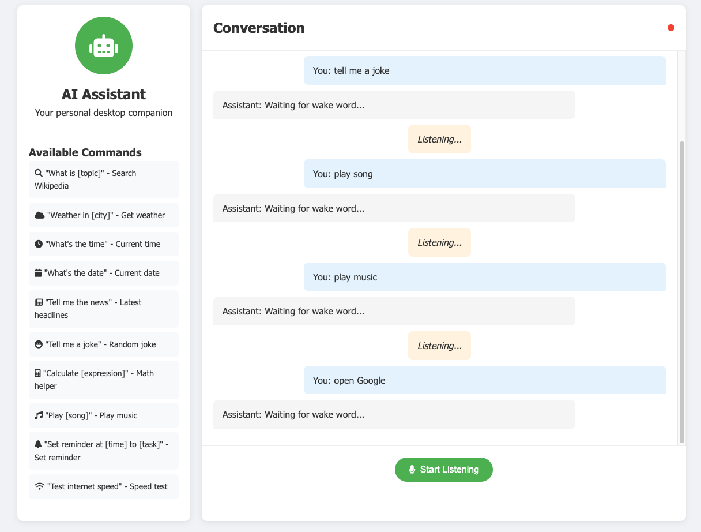

# AI Desktop Assistant

A Python-based AI desktop assistant designed to perform various tasks like opening websites, searching Wikipedia, playing music, retrieving the current time, and more. The assistant uses speech recognition and text-to-speech to interact with the user in a conversational manner.




## Features

- **Wikipedia Search**: Ask questions like "Who is Elon Musk?" or "What is Python?"
- **Website Commands**: Open popular websites such as YouTube, Google, Gmail, and LeetCode.
- **Music Playback**: Play songs directly from YouTube with a simple command.
- **Time Queries**: Get the current time instantly.
- **News Updates**: Access the latest news headlines from Google News.
- **Search the Web**: Perform Google searches directly from your voice commands.
- **Platform-Specific TTS**: Text-to-Speech support for macOS, Windows, and Linux.

## Prerequisites

Make sure you have the following installed:

- Python 3.7 or later
- Required Python libraries (see below for installation)

## Installation

1. **Clone the repository**:
   ```bash
   git clone https://github.com/jmrashed/ai-desktop-assistant.git
   cd ai-desktop-assistant
   ```

2. **Install dependencies**:
   Install the required Python libraries using `pip`:
   ```bash
   pip install -r requirements.txt
   ```

   Here are the libraries required:
   - `SpeechRecognition`
   - `pyttsx3` (for Windows)
   - `gTTS` (for Linux)
   - `playsound` (for Linux)
   - `pywhatkit`
   - `wikipedia-api`
   - `platform`
   - `datetime`

3. **Run the program**:
   ```bash
   python assistant.py
   ```

## Usage

1. Start the assistant by running the `assistant.py` script.
2. The assistant will greet you based on the time of day.
3. Give voice commands, such as:
   - **"Who is Albert Einstein?"**: The assistant will search Wikipedia and read a summary.
   - **"Open YouTube"**: Opens YouTube in your browser.
   - **"Play Despacito"**: Plays the song on YouTube.
   - **"What time is it?"**: Tells the current time.
   - **"Search artificial intelligence"**: Performs a Google search.
   - **"Goodbye"**: Shuts down the assistant.

## Project Structure

```
ai-desktop-assistant/
├── assistant.py         # Main Python script
├── requirements.txt     # Dependencies for the project
├── README.md            # Documentation
```

## Platform-Specific Text-to-Speech

- **macOS**: Uses the built-in `say` command for text-to-speech.
- **Windows**: Uses the `pyttsx3` library.
- **Linux**: Uses `gTTS` and `playsound`.

If TTS is unavailable for a platform, the assistant will fall back to printing the output to the terminal.

## Contributing

Feel free to contribute to the project! Here's how:

1. Fork the repository.
2. Create a new feature branch:
   ```bash
   git checkout -b feature-name
   ```
3. Commit your changes:
   ```bash
   git commit -m "Add some feature"
   ```
4. Push the branch:
   ```bash
   git push origin feature-name
   ```
5. Open a pull request.

## License

This project is licensed under the MIT License. See the `LICENSE` file for details.

## Contact

If you have any questions or feedback, feel free to reach out:

- **Author**: Md Rasheduzzaman
- **Email**: jmrashed@gmail.com
- **GitHub**: [jmrashed](https://github.com/jmrashed)
 