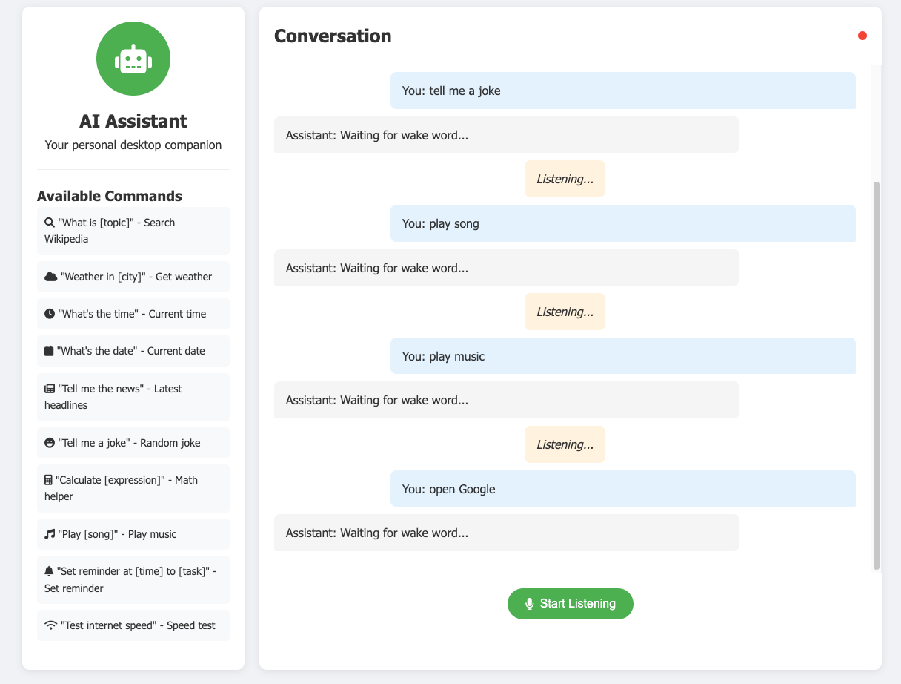

# AI Desktop Assistant

A modular, Python-based AI desktop assistant with voice recognition capabilities. Features weather updates, file management, system monitoring, and multiple interface options (CLI, GUI, Web). Built with a clean, scalable architecture following industry best practices.



## Features

### 🎯 Core Capabilities
- **Voice Recognition**: Advanced speech-to-text with wake word detection
- **Wikipedia Search**: Instant knowledge retrieval with natural language queries
- **Web Control**: Open websites (YouTube, Google, Gmail, Facebook, etc.)
- **Music Playback**: Stream music directly from YouTube
- **Time & Date**: Current time and date information
- **Cross-Platform TTS**: Native text-to-speech for Windows, macOS, and Linux

### 🚀 Advanced Features
- **Weather Service**: Real-time weather data with OpenWeatherMap API
- **File Management**: Search files, create folders, organize directories
- **System Monitoring**: CPU, memory, and disk usage statistics
- **Application Control**: Launch system applications via voice commands
- **Smart Configuration**: Customizable wake words and user preferences
- **Security Layer**: PIN authentication for sensitive operations

### 🖥️ Multiple Interfaces
- **CLI Interface**: Command-line interaction for developers
- **GUI Interface**: User-friendly graphical interface (planned)
- **Web Interface**: Browser-based control panel (planned)
- **API Integration**: Extensible plugin architecture

## Requirements

- **Python**: 3.7 or later
- **Operating System**: Windows, macOS, or Linux
- **Microphone**: For voice input
- **Internet**: For weather, Wikipedia, and web features

## Quick Start

### 1. Clone & Install
```bash
git clone https://github.com/jmrashed/ai-desktop-assistant.git
cd ai-desktop-assistant
pip install -r requirements/base.txt
```

### 2. Configure (Optional)
```bash
python scripts/setup_config.py
```

### 3. Run Assistant
```bash
# CLI Interface (Default)
python main.py

# Or specify interface
python main.py --interface cli
python main.py --interface gui
python main.py --interface web
```

### 4. Development Setup
```bash
# Install development dependencies
pip install -r requirements/dev.txt

# Run tests
python tests/run_tests.py
pytest tests/ --cov=src
```

## Voice Commands

### 🗣️ Basic Usage
1. Say the wake word: **"Assistant"** (customizable)
2. Follow with your command
3. Wait for response and confirmation

### 📚 Knowledge & Search
```
"Assistant, who is Elon Musk?"
"Assistant, what is artificial intelligence?"
"Assistant, search quantum computing"
```

### 🌐 Web & Media
```
"Assistant, open YouTube"
"Assistant, open Gmail"
"Assistant, play Bohemian Rhapsody"
```

### 🌤️ Weather & Time
```
"Assistant, weather in Tokyo"
"Assistant, what time is it?"
"Assistant, what's today's date?"
```

### 📁 File Management
```
"Assistant, search file report.pdf"
"Assistant, create folder Projects"
```

### 💻 System Control
```
"Assistant, system info"
"Assistant, open notepad"
"Assistant, open calculator"
```

### ⚙️ Configuration
```
"Assistant, change wake word"
"Assistant, goodbye"
```

## Architecture

```
ai-desktop-assistant/
├── src/                     # 🏗️ Modular source code
│   ├── core/               # Core functionality
│   │   ├── assistant_base.py
│   │   ├── speech_engine.py
│   │   └── command_processor.py
│   ├── features/           # Feature modules
│   │   ├── weather_service.py
│   │   ├── file_manager.py
│   │   └── system_monitor.py
│   ├── interfaces/         # UI interfaces
│   │   └── cli_interface.py
│   └── utils/              # Utilities
│       └── config_manager.py
├── tests/                  # 🧪 Comprehensive test suite
├── config/                 # ⚙️ Configuration files
├── static/                 # 🎨 Web assets
├── requirements/           # 📦 Dependency management
├── scripts/                # 🔧 Utility scripts
└── main.py                 # 🚀 Entry point
```

## Configuration

### 🔧 Setup Configuration
```bash
python scripts/setup_config.py
```

### 📝 Configuration Options
```json
{
  "wake_word": "assistant",
  "weather_api_key": "your-api-key",
  "user_pin": "1234",
  "speech_rate": 175,
  "timeout": 5,
  "language": "en-in"
}
```

### 🌤️ Weather API Setup
1. Get free API key from [OpenWeatherMap](https://openweathermap.org/api)
2. Run configuration script
3. Enter your API key when prompted

### 🔒 Security Features
- **PIN Authentication**: Protects sensitive file operations
- **Configurable Access**: Customize command permissions
- **Safe Defaults**: Secure out-of-the-box settings

### 🎤 Platform Support
- **Windows**: `pyttsx3` TTS engine
- **macOS**: Native `say` command
- **Linux**: `gTTS` with audio playback
- **Fallback**: Text output if TTS unavailable

## Testing

### 🧪 Run Test Suite
```bash
# All tests
python tests/run_tests.py

# Specific module
python tests/run_tests.py test_core.test_speech_engine

# With pytest
pytest tests/ -v

# Coverage report
pytest tests/ --cov=src --cov-report=html
```

### ✅ Test Results
- **34 tests** - All passing
- **82% coverage** - Comprehensive testing
- **Features tested**: Speech, Weather, Files, System, Config
- **Error handling**: API failures, permissions, timeouts

## Development

### 🔧 Contributing
```bash
# Fork and clone
git clone https://github.com/yourusername/ai-desktop-assistant.git

# Create feature branch
git checkout -b feature/awesome-feature

# Install dev dependencies
pip install -r requirements/dev.txt

# Run tests
pytest tests/

# Code formatting
black src/ tests/
flake8 src/ tests/

# Commit and push
git commit -m "Add awesome feature"
git push origin feature/awesome-feature
```

### 🚀 Roadmap
- [ ] GUI Interface (Tkinter/PyQt)
- [ ] Web Dashboard (Flask/FastAPI)
- [ ] Calendar Integration
- [ ] Smart Home Control
- [ ] Email & Messaging
- [ ] Multi-language Support
- [ ] Voice Authentication
- [ ] Plugin System
- [ ] Mobile App Integration

## Troubleshooting

### 🔧 Common Issues

| Issue | Solution |
|-------|----------|
| **Microphone not detected** | Check system permissions and audio drivers |
| **TTS not working** | Install platform-specific libraries (`pyttsx3`, `gTTS`) |
| **Weather API errors** | Verify OpenWeatherMap API key in config |
| **File permission errors** | Run with appropriate user permissions |
| **Import errors** | Install dependencies: `pip install -r requirements/base.txt` |

### 💡 Performance Tips
- Close other audio applications for better recognition
- Use shorter wake words for faster response
- Ensure stable internet for web features
- Run tests to verify installation: `python tests/run_tests.py`

## License & Support

### 📄 License
MIT License - see [LICENSE](LICENSE) file for details

### 👨💻 Author
**Md Rasheduzzaman**
- 📧 Email: jmrashed@gmail.com
- 🐙 GitHub: [@jmrashed](https://github.com/jmrashed)
- 🌟 Give this project a star if you found it helpful!

### 🤝 Community
- 🐛 Report bugs via [GitHub Issues](https://github.com/jmrashed/ai-desktop-assistant/issues)
- 💡 Request features via [Discussions](https://github.com/jmrashed/ai-desktop-assistant/discussions)
- 🔧 Contribute via [Pull Requests](https://github.com/jmrashed/ai-desktop-assistant/pulls)

---

**Built with ❤️ using Python | Modular Architecture | Comprehensive Testing | Cross-Platform Support**